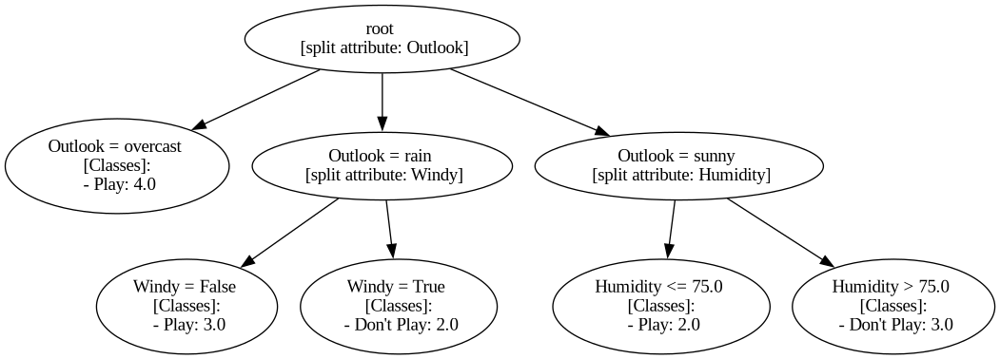

Visualization
=============

**c4dot5** has a convenient way to visualize the decision tree classifier, using the method .view().
The method takes in input the name of the model and saves the image as a png file. You can also choose the file path, default is "./figures/".
If you need to save the image without displaying it, you can disable the automatic render with the parameter *view* set to False (default=True).
Using the model trained in :ref:`training`:

.. code-block:: Python

   import pickle
   
   with open('./example.classifier', 'rb') as file:
      decision_tree = pickle.load(file)

   decision_tree.view('example-tree', view=True, folder_name='./figures')

The corresponding visualization is 

The first row of every node points out the value taken by the attribute chosen in the previous split which identifies the node itself (*root* does not have a previous split). 
Square brackets for *non-leaves* contain the attribute chosen for the next split after the node. 

*Leaves*, i.e. nodes at the lowest level, report also the sum of the weighted instances for every class that reached the node in the training phase (in this simple case just one). 
